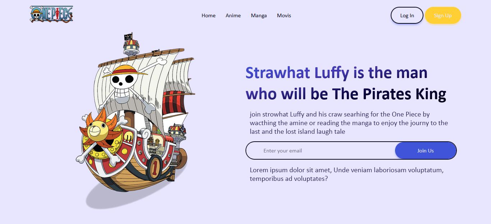

# One Piece Hero Intro

Welcome I am [Samir Ahmad](samirahmad5445@gmail.com) and this is a simple Hero intro for one of the best stories ever told One Piece

## Table of contents

- [Overview](#overview)
  - [Screenshot](#screenshot)
  - [Links](#links)
- [Some Code Snippets](#some-code-snippets)
  - [Generate Custom Props](#genrate-custom-props)
  - [Animation Mixin](#simple-animation-mixin)
  - [Function to Convert Units](#function-to-convert-units)
- [Find Me on](#find-me-on)
  - [GitHub - @SamirAhmad5445](https://github.com/SamirAhmad5445)
  - [Gmaill - samirahmad5445@gmail.com](mailto:samirahmad5445@gmail.com)

## Overview

### Screenshot



### Links

- Solution URL: [https://github.com/SamirAhmad5445/one-piece-hero-intro](https://github.com/SamirAhmad5445/one-piece-hero-intro)
- Live Site URL: [https://samirahmad5445.github.io/one-piece-hero-intro/](https://samirahmad5445.github.io/one-piece-hero-intro/)

## Some Code Snippets

### genrate custom props

```scss
:root {
  @each $color, $shades in $colors {
    /* color: #{$color} */
    @each $shade, $value in $shades {
      --clr-#{$color}-#{$shade}: #{$value};
    }
  }
  /* Size system */
  @each $size, $value in $sizes {
    --size-#{$size}: #{$value};
  }
}
```

### simple animation mixin

```scss
@mixin animate($name, $props) {
  animation: $name $props;
  @keyframes #{$name} {
    @content;
  }
}
```

### function to convert units

```scss
@function convert-unit($num, $unit: em) {
  @if type-of($num) != number {
    @error '#{$num} is not a number';
  } @else {
    @if math.is-unitless($num) {
      @return calc($num / 16) + $unit;
    } @else {
      @if str-slice(#{$num}, -2) != "px" {
        @error 'only pixel values is accepted';
      } @else {
        @return str-slice(#{calc($num / 16)}, 1, -3) + $unit;
      }
    }
  }
}
```

## find me on

- GitHub - [@SamirAhmad5445](https://github.com/SamirAhmad5445)
- Gmaill - [samirahmad5445@gmail.com](mailto:samirahmad5445@gmail.com)
